# ERD v0 — Regis SG-SST Platform

**Versión:** v0
**Fecha:** 2026-04-28
**Autor:** Operador-Agent
**Tarea:** [T-F0-018](../../tasks/02_lista_maestra_tareas.md#t-f0-018--borrador-erd-v0-en-dbdiagramio)
**Issue:** [#13](https://github.com/dmaorisas/regis-sgsst-platform/issues/13)
**Decisiones PM aplicadas:** D-002 (pivote no-Regis, datos públicos), D-003 (multi-empresa día 1), ADR-02 conceptual (centros de trabajo + multi-CIIU).

> Este documento es el modelo de datos canónico inicial de la plataforma. Versión `v1` se entregará en T-F0-024 con refinamientos derivados de la llamada con Regis.

---

## 1. Diagrama (Mermaid)

```mermaid
erDiagram
  %% =========================================================
  %% ERD v0 — Regis SG-SST Platform
  %% =========================================================

  regis_orgs {
    uuid id PK
    text nombre
    text nit UK
    text contact_email
    text plan_tier
    timestamptz created_at
    timestamptz updated_at
    timestamptz deleted_at
  }
  companies {
    uuid id PK
    uuid regis_org_id FK
    text razon_social
    text nit UK
    text ciiu_principal FK
    int clase_riesgo_principal
    int n_trabajadores_estimado
    text departamento
    text ciudad
    timestamptz created_at
    timestamptz updated_at
    timestamptz deleted_at
  }
  centros_de_trabajo {
    uuid id PK
    uuid company_id FK
    text nombre
    text direccion
    text ciudad
    text ciiu_centro FK
    int clase_riesgo_centro
    int n_trabajadores
    boolean es_principal
    timestamptz created_at
    timestamptz updated_at
    timestamptz deleted_at
  }
  ciiu_codes {
    text codigo PK
    text descripcion
    int clase_riesgo
    text division
    text grupo
  }
  ciiu_hazard_mapping {
    uuid id PK
    text ciiu_codigo FK
    text peligro_categoria
    text peligro_descripcion
    text fuente_referencia
    int prioridad
  }
  empresa_ciiu {
    uuid id PK
    uuid company_id FK
    text ciiu_codigo FK
    boolean es_principal
    timestamptz valid_from
    timestamptz valid_to
  }
  eps_catalog { uuid id PK text codigo UK text nombre boolean activo }
  afp_catalog { uuid id PK text codigo UK text nombre boolean activo }
  arl_catalog { uuid id PK text codigo UK text nombre boolean activo }
  document_types {
    uuid id PK
    text codigo UK
    text nombre
    text categoria
    boolean requiere_vigencia
    int retencion_meses
  }
  standards_0312 {
    uuid id PK
    text codigo UK
    text titulo
    numeric peso
    text ciclo_phva
    text capitulo
    int aplica_desde_trabajadores
    int aplica_hasta_trabajadores
    text clase_riesgo_aplica
  }

  users {
    uuid id PK
    text email UK
    text nombre_completo
    text auth_provider
    boolean activo
    timestamptz created_at
    timestamptz updated_at
    timestamptz deleted_at
  }
  roles { uuid id PK text codigo UK text nombre jsonb permisos }
  user_company_role {
    uuid id PK
    uuid user_id FK
    uuid company_id FK
    uuid role_id FK
    uuid regis_org_id FK
    timestamptz valid_from
    timestamptz valid_to
  }
  workers {
    uuid id PK
    text tipo_documento
    text numero_documento UK
    text nombres
    text apellidos
    date fecha_nacimiento
    uuid eps_id FK
    uuid afp_id FK
  }
  worker_company {
    uuid id PK
    uuid worker_id FK
    uuid company_id FK
    uuid centro_id FK
    text cargo
    text tipo_contrato
    uuid arl_id FK
    date fecha_ingreso
    date fecha_retiro
    boolean activo
  }

  standard_evaluations {
    uuid id PK
    uuid company_id FK
    uuid centro_id FK
    uuid standard_id FK
    text status
    numeric peso_obtenido
    text justificacion
    uuid evidencia_documento_id FK
    uuid evaluado_por_user_id FK
    timestamptz evaluado_at
  }
  evaluation_snapshots {
    uuid id PK
    uuid company_id FK
    uuid centro_id FK
    date snapshot_month
    numeric porcentaje_global
    jsonb breakdown_phva
    jsonb breakdown_capitulos
    text status_general
  }
  documents {
    uuid id PK
    uuid company_id FK
    uuid centro_id FK
    uuid document_type_id FK
    text titulo
    text version
    text file_url
    date valid_from
    date valid_until
  }

  committees {
    uuid id PK
    uuid company_id FK
    uuid centro_id FK
    text tipo
    text nombre
    date constituido_el
    date vigencia_hasta
  }
  committee_members {
    uuid id PK
    uuid committee_id FK
    uuid worker_id FK
    text rol
    text representacion
    date desde
    date hasta
  }
  meeting_actas {
    uuid id PK
    uuid committee_id FK
    date fecha
    text agenda
    text contenido_md
    text file_url
  }
  compromisos {
    uuid id PK
    uuid acta_id FK
    text descripcion
    uuid responsable_worker_id FK
    date fecha_compromiso
    date fecha_cumplimiento
    text status
  }

  medical_exams {
    uuid id PK
    uuid worker_id FK
    uuid company_id FK
    text tipo_examen
    date fecha_examen
    text concepto_aptitud
    jsonb recomendaciones
    text file_url_secure
    text bucket_name
    int retention_years
    uuid extracted_by_ai_run_id FK
  }
  risk_matrices {
    uuid id PK
    uuid company_id FK
    uuid centro_id FK
    text version
    text metodologia
    jsonb peligros
    jsonb evaluacion
    text status
  }
  emergency_plans {
    uuid id PK
    uuid company_id FK
    uuid centro_id FK
    text version
    text contenido_md
    jsonb brigadas
    jsonb rutas_evacuacion
    date vigencia_desde
    date vigencia_hasta
  }
  furat_reports {
    uuid id PK
    uuid company_id FK
    uuid centro_id FK
    uuid worker_id FK
    text numero_reporte UK
    date fecha_accidente
    text severidad
    boolean reportado_arl
  }

  audit_log {
    uuid id PK
    timestamptz created_at
    uuid actor_user_id FK
    text actor_type
    text action
    text entity_type
    uuid entity_id
    uuid company_id FK
    uuid regis_org_id FK
    jsonb old_values
    jsonb new_values
  }
  consents {
    uuid id PK
    uuid worker_id FK
    uuid company_id FK
    text consent_type
    text version_politica
    timestamptz aceptado_at
    timestamptz revocado_at
  }
  notifications {
    uuid id PK
    uuid recipient_user_id FK
    uuid recipient_worker_id FK
    text channel
    text template_codigo
    jsonb payload
    text status
    timestamptz sent_at
  }
  ai_usage {
    uuid id PK
    timestamptz created_at
    text agent_id
    text task_id
    text complexity_level
    text provider
    text model
    int prompt_tokens
    int completion_tokens
    numeric cost_usd
    text request_hash
  }
  ai_outputs_pending_review {
    uuid id PK
    uuid ai_usage_id FK
    text entity_type
    uuid entity_id
    jsonb output_payload
    numeric confidence
    text status
  }
  pg_boss_jobs {
    uuid id PK
    text name
    jsonb data
    text state
    int retry_count
    timestamptz created_on
    timestamptz completed_on
  }
  loop_detections {
    uuid id PK
    text trigger_code
    text severity
    text agent_id
    text task_id
    jsonb evidence
    text action_taken
    boolean resolved
  }
  auditor_findings {
    uuid id PK
    text audit_run_id
    text severity
    text rule_violated
    text task_id
    jsonb evidence
    text status
  }

  regis_orgs ||--o{ companies : "consultora administra"
  companies ||--o{ centros_de_trabajo : "tiene centros"
  companies ||--o{ empresa_ciiu : "tiene CIIU(s)"
  ciiu_codes ||--o{ empresa_ciiu : "es asignado a"
  ciiu_codes ||--o{ ciiu_hazard_mapping : "mapea peligros"
  ciiu_codes ||--o{ companies : "ciiu_principal"
  ciiu_codes ||--o{ centros_de_trabajo : "ciiu del centro"

  regis_orgs ||--o{ user_company_role : "scope consultora"
  companies ||--o{ user_company_role : "scope empresa"
  users ||--o{ user_company_role : "tiene rol en"
  roles ||--o{ user_company_role : "asigna"

  workers ||--o{ worker_company : "trabaja en"
  companies ||--o{ worker_company : "emplea a"
  centros_de_trabajo ||--o{ worker_company : "asignado a centro"
  eps_catalog ||--o{ workers : "afilia EPS"
  afp_catalog ||--o{ workers : "afilia AFP"
  arl_catalog ||--o{ worker_company : "afilia ARL"

  companies ||--o{ standard_evaluations : "es evaluada"
  centros_de_trabajo ||--o{ standard_evaluations : "evaluación por centro"
  standards_0312 ||--o{ standard_evaluations : "estándar evaluado"
  documents ||--o{ standard_evaluations : "evidencia"
  users ||--o{ standard_evaluations : "evaluado por"

  companies ||--o{ evaluation_snapshots : "snapshot mensual"
  centros_de_trabajo ||--o{ evaluation_snapshots : "snapshot mensual"

  companies ||--o{ documents : "tiene documentos"
  centros_de_trabajo ||--o{ documents : "documentos del centro"
  document_types ||--o{ documents : "clasifica"
  users ||--o{ documents : "subió"

  companies ||--o{ committees : "tiene comités"
  centros_de_trabajo ||--o{ committees : "comité por centro"
  committees ||--o{ committee_members : "tiene miembros"
  workers ||--o{ committee_members : "es miembro"
  committees ||--o{ meeting_actas : "tiene actas"
  meeting_actas ||--o{ compromisos : "genera compromisos"
  workers ||--o{ compromisos : "es responsable"
  users ||--o{ meeting_actas : "genera acta"

  workers ||--o{ medical_exams : "tiene exámenes"
  companies ||--o{ medical_exams : "ordena examen"
  companies ||--o{ risk_matrices : "tiene matrices"
  centros_de_trabajo ||--o{ risk_matrices : "matriz por centro"
  users ||--o{ risk_matrices : "aprueba"
  companies ||--o{ emergency_plans : "tiene plan"
  centros_de_trabajo ||--o{ emergency_plans : "plan por centro"
  companies ||--o{ furat_reports : "reporta accidentes"
  centros_de_trabajo ||--o{ furat_reports : "accidente en centro"
  workers ||--o{ furat_reports : "trabajador accidentado"

  users ||--o{ audit_log : "actor"
  companies ||--o{ audit_log : "scope empresa"
  regis_orgs ||--o{ audit_log : "scope consultora"
  workers ||--o{ consents : "consentimiento"
  companies ||--o{ consents : "consentimiento empresa"
  users ||--o{ notifications : "destinatario user"
  workers ||--o{ notifications : "destinatario worker"
  ai_usage ||--o{ ai_outputs_pending_review : "output marcado"
  users ||--o{ ai_outputs_pending_review : "revisor"
  ai_usage ||--o{ medical_exams : "extracción IA"
  users ||--o{ auditor_findings : "revisor"
```



> El archivo canónico es `v0.mmd`. Esta sección embebida es copia para visualización en GitHub. En caso de divergencia, manda `v0.mmd`.

---

## 2. Tabla resumen de entidades (33 totales)

### Tenancy & Catálogos (10)

| # | Entidad | Propósito |
|---|---|---|
| 1 | `regis_orgs` | Top tenant: organización consultora SG-SST que administra N empresas. |
| 2 | `companies` | Empresa cliente (NIT único). Aislada por `regis_org_id`. |
| 3 | `centros_de_trabajo` | Centro físico de una empresa, con CIIU y clase de riesgo propios. |
| 4 | `ciiu_codes` | Catálogo público DANE rev.4 con clase de riesgo I-V. |
| 5 | `ciiu_hazard_mapping` | Peligros típicos GTC-45 asociados a cada CIIU (D-002, datos públicos). |
| 6 | `empresa_ciiu` | Pivot N:M empresa ↔ CIIU (una empresa puede tener varios CIIU). |
| 7 | `eps_catalog` | Catálogo de Entidades Promotoras de Salud activas. |
| 8 | `afp_catalog` | Catálogo de Administradoras de Fondos de Pensiones. |
| 9 | `arl_catalog` | Catálogo de Administradoras de Riesgos Laborales. |
| 10 | `document_types` | Tipologías documentales con vigencia y retención. |

### Cumplimiento normativo (1)

| # | Entidad | Propósito |
|---|---|---|
| 11 | `standards_0312` | 60 estándares de Resolución 0312/2019 con peso, PHVA, capítulo. |

### Personas y Roles (5)

| # | Entidad | Propósito |
|---|---|---|
| 12 | `users` | Usuarios autenticables del sistema. |
| 13 | `roles` | Roles funcionales (regis_admin, regis_consultant, client_admin, worker). |
| 14 | `user_company_role` | Pivot N:M users ↔ companies con rol y vigencia. |
| 15 | `workers` | Trabajador (persona). PK natural via `numero_documento` (UK). |
| 16 | `worker_company` | Pivot N:M workers ↔ companies con historia laboral, cargo, ARL. |

### Cumplimiento operacional (3)

| # | Entidad | Propósito |
|---|---|---|
| 17 | `standard_evaluations` | Evaluación por centro de cada estándar 0312 (cumple/no/no_aplica/pendiente). |
| 18 | `evaluation_snapshots` | Foto inmutable mensual del % global por empresa/centro. |
| 19 | `documents` | Repositorio documental con vigencia y hash. |

### Comités (4)

| # | Entidad | Propósito |
|---|---|---|
| 20 | `committees` | Comité (COPASST/Convivencia/Brigada) por centro. |
| 21 | `committee_members` | Integrantes con rol (principal/suplente, representación). |
| 22 | `meeting_actas` | Actas de reuniones de comité. |
| 23 | `compromisos` | Tareas derivadas de actas con responsable y fecha. |

### Especializadas (4)

| # | Entidad | Propósito |
|---|---|---|
| 24 | `medical_exams` | Exámenes médicos ocupacionales (bucket privado, retención 20 años). |
| 25 | `risk_matrices` | Matrices GTC-45 versionadas con peligros y valoración. |
| 26 | `emergency_plans` | Planes de emergencia por centro con brigadas y rutas. |
| 27 | `furat_reports` | Formularios Único de Reporte de Accidentes de Trabajo. |

### Sistema (6)

| # | Entidad | Propósito |
|---|---|---|
| 28 | `audit_log` | Registro append-only particionado por mes; trazabilidad obligatoria (R6.5). |
| 29 | `consents` | Habeas Data Ley 1581/2012, versión política aceptada. |
| 30 | `notifications` | Cola multi-canal (email/WhatsApp/in-app/SMS). |
| 31 | `ai_usage` | Tracking de tokens, costo y latencia por llamada IA (router 06_llm_routing). |
| 32 | `ai_outputs_pending_review` | Cola humana para outputs IA con confianza < umbral. |
| 33 | `pg_boss_jobs` | Cola de jobs (creada por la librería pg-boss). |

### Observabilidad de agentes (2)

| # | Entidad | Propósito |
|---|---|---|
| 34 | `loop_detections` | Eventos del Loop Detector (security/02_loop_detector.md). |
| 35 | `auditor_findings` | Hallazgos del Auditor-Agent (governance/07). |

**Total:** 35 entidades — supera el mínimo de 25 exigido por el spec.

---

## 3. Decisiones de diseño no obvias

> Conforme R7: cada decisión técnica no especificada en el spec queda documentada aquí. Algunas decisiones se elevan a candidatos de ADR formal en T-F0-026 y posteriores.

### D-ERD-01 — `workers` desacoplado de `companies` con pivot histórico

**Contexto:** Un trabajador puede pasar por múltiples empresas a lo largo de su vida laboral, y la legislación colombiana exige conservar evidencias por años incluso cuando el trabajador se retira.

**Decisión:** `workers` es entidad maestra (PK natural `numero_documento`), y la relación con `companies` vive en `worker_company` con `fecha_ingreso`/`fecha_retiro`. Datos médicos y exámenes apuntan al `worker_id` global.

**Implicación:** Permite re-onboarding del mismo trabajador sin duplicar registros, y soporta consolidar histórico entre empresas de la misma `regis_org`. Recordar: RLS debe filtrar por `worker_company.company_id`, NO por `workers` directamente.

### D-ERD-02 — `centros_de_trabajo` como entidad de primera clase con CIIU propio

**Contexto:** ADR-02 conceptual ya escrito: una empresa puede tener centros con clase de riesgo distinta (oficina nivel I + planta nivel V).

**Decisión:** `centros_de_trabajo.ciiu_centro` y `clase_riesgo_centro` son campos propios, no calculados desde la empresa. `standard_evaluations` permite `centro_id` opcional para soportar evaluaciones a nivel empresa o por centro.

**Implicación:** El motor de cumplimiento debe poder calcular % por centro y agregado por empresa. Si `centro_id` es null, la evaluación es a nivel empresa.

### D-ERD-03 — `evaluation_snapshots` inmutable, sin `updated_at` ni `deleted_at`

**Contexto:** El demo del 6 de mayo necesita mostrar evolución del % en el tiempo. Si los snapshots fueran mutables, no habría auditoría histórica confiable.

**Decisión:** Snapshots son append-only. Solo tienen `created_at`. Si una evaluación cambia retroactivamente, se genera un snapshot nuevo del mes actual y los pasados quedan congelados.

**Implicación:** El frontend de tendencias se construye sobre estos snapshots; nunca recalcula desde `standard_evaluations` para meses cerrados.

### D-ERD-04 — `medical_exams` con bucket separado y `retention_years` explícito

**Contexto:** Ley 1581/2012 (Habeas Data) clasifica datos médicos como sensibles. Ley 1562/2012 exige retención mínima 20 años.

**Decisión:** `file_url_secure` apunta a un bucket `medical_exams_secure` con RLS estricta (solo médico ocupacional + admin de empresa) y políticas de retención automatizadas. El campo `retention_years` permite ajuste por jurisdicción futura.

**Implicación:** El flujo de borrado regular (`deleted_at`) NO purga el archivo; un job aparte (`pg_boss_jobs`) maneja el ciclo de vida tras 20 años.

### D-ERD-05 — `audit_log` particionado por mes y append-only

**Contexto:** El log de auditoría es la columna vertebral de R6.5 (trazabilidad obligatoria). Sin partición, una empresa con alto volumen lo vuelve inutilizable en 6 meses.

**Decisión:** `audit_log` es PARTITION BY RANGE (`created_at`) con partición mensual automática. No tiene `updated_at` ni `deleted_at`: append-only por diseño. Incluye `actor_type` para distinguir usuarios humanos de los 4 agentes IA.

**Implicación:** Migración inicial debe crear las primeras 12 particiones; un cron de pg-boss crea la siguiente cada mes. Queries siempre incluyen filtro temporal.

### D-ERD-06 — `ai_usage.request_hash` para detector de loops

**Contexto:** `security/02_loop_detector.md` Trigger 5 detecta agente que invoca el mismo prompt+input ≥ 3 veces en 30 min.

**Decisión:** `ai_usage.request_hash` (SHA-256 de prompt+input normalizados) es campo indexado. El loop detector hace una query contra esta tabla, no contra logs separados.

**Implicación:** Cada llamada al router LLM (governance/06) debe calcular y persistir el hash antes de invocar al provider.

### D-ERD-07 — `consents` con versión de política y `revocado_at`

**Contexto:** Ley 1581 exige consentimiento informado, versionable y revocable.

**Decisión:** `consents.version_politica` apunta a la versión textual aceptada (no FK a una tabla de políticas porque la política puede ser markdown estático). `revocado_at` permite trazabilidad sin borrar el registro.

**Implicación:** Antes de cualquier procesamiento de datos, el sistema valida `consents` activo (revocado_at IS NULL).

### D-ERD-08 — `user_company_role` permite `company_id` NULL para scope consultora

**Contexto:** Un consultor de Regis necesita acceso a varias empresas del mismo `regis_org`, sin tener que crear N filas.

**Decisión:** `user_company_role.company_id` es nullable. Si null, el rol aplica a TODAS las empresas dentro de `regis_org_id` (scope consultora). Si tiene valor, scope acotado a esa empresa.

**Implicación:** Las políticas RLS son una rama OR: `(company_id = current AND role activo)` OR `(company_id IS NULL AND regis_org_id = current_org)`.

### D-ERD-09 — `compromisos` como entidad propia, no campo `jsonb` en actas

**Contexto:** Compromisos disparan notificaciones automatizadas y reportes de cumplimiento independientes del acta.

**Decisión:** `compromisos` es tabla con `responsable_worker_id`, `fecha_compromiso`, `status`. Se relaciona con el acta via `acta_id`.

**Implicación:** Los recordatorios son jobs en `pg_boss_jobs` que consultan `compromisos WHERE status='pendiente' AND fecha_compromiso <= now()+interval '3 days'`.

### D-ERD-10 — `pg_boss_jobs` como tabla declarada (gestionada por librería)

**Contexto:** pg-boss crea sus propias tablas en el schema `pgboss`. Documentarla en el ERD evita confusión cuando aparezca tras la primera migración.

**Decisión:** Está en el ERD pero marcada como administrada por la librería. No se modifica su esquema.

**Implicación:** El equipo no escribe migraciones SQL para esta tabla; la propia librería lo hace.

---

## 4. Cómo se conecta con la arquitectura

### 4.1 Multi-tenancy y RLS

Toda tabla con datos de cliente lleva al menos uno de:
- `regis_org_id` (alcance consultora)
- `company_id` (alcance empresa)

La política RLS estándar de Supabase será del tipo:

```sql
USING (
  company_id IN (
    SELECT company_id FROM user_company_role
    WHERE user_id = auth.uid()
      AND deleted_at IS NULL
      AND (valid_to IS NULL OR valid_to > now())
  )
  OR EXISTS (
    SELECT 1 FROM user_company_role ucr
    WHERE ucr.user_id = auth.uid()
      AND ucr.company_id IS NULL
      AND ucr.regis_org_id = (SELECT regis_org_id FROM companies WHERE id = company_id)
  )
)
```

Esta política se replica en `documents`, `standard_evaluations`, `committees`, `medical_exams` y todas las tablas operacionales. Los catálogos públicos (`ciiu_codes`, `eps_catalog`, etc.) son lectura pública.

### 4.2 Auditoría (R6.5)

Toda mutación crítica dispara un trigger Postgres que escribe en `audit_log` con:
- `actor_user_id` desde `auth.uid()`
- `actor_type` = `'user'` para humanos, `'operador_agent'` etc. para los 4 agentes IA (set via JWT custom claim)
- `old_values` y `new_values` como diff JSONB

La partición mensual mantiene queries rápidas. El Auditor-Agent (governance/07) lee este log via SQL en su Capa 1 (sin LLM).

### 4.3 Anti-alucinación IA (4 capas)

La capa **"output queue para revisión humana"** del system prompt se materializa en `ai_outputs_pending_review`. Cuando el router LLM (governance/06) genera output con `confidence < require_human_review_if_confidence_below`, el resultado se persiste en esta cola y NO se aplica al dato real hasta revisión.

`ai_usage.request_hash` cierra el loop con el Loop Detector (Trigger 5). `medical_exams.extracted_by_ai_run_id → ai_usage.id` deja trazable cuál corrida de IA produjo cada extracción de un examen.

### 4.4 Auditor Agent + Loop Detector (4to agente sombra)

- `auditor_findings` recibe los hallazgos batch del Auditor cada 4h.
- `loop_detections` registra cada disparo de los 6 triggers del Loop Detector.

Ambas tablas son de solo escritura desde el agente, lectura humana. No tienen `deleted_at` para preservar evidencia.

### 4.5 Habeas Data y datos sensibles

- `consents` valida que cada trabajador haya aceptado la política antes de cualquier procesamiento IA.
- `medical_exams` está en bucket separado (`bucket_name`) con retención 20 años.
- `audit_log` registra todo acceso/modificación a datos sensibles.
- `workers.numero_documento` es UK pero NO se hashea (necesario para matching contra PILA y entidades externas); su acceso queda auditado.

### 4.6 Conexión con tareas posteriores

| Entidad / Decisión | Tarea futura que la consume |
|---|---|
| `standards_0312` | T-F1-NN — seed de los 60 estándares con peso. |
| `ciiu_hazard_mapping` | T-F0-023 — sesión 2h con consultor sénior Regis para poblar. |
| `evaluation_snapshots` | T-F1-NN — motor de cumplimiento + dashboard de tendencias. |
| RLS multi-tenant | T-F1-NN — políticas RLS por tabla y test multi-tenant. |
| `audit_log` particionado | T-F1-NN — migración inicial + cron de partición mensual. |
| `medical_exams` bucket | T-F1-NN — bucket privado Supabase + políticas de retención. |
| `ai_usage.request_hash` | T-F0-NN — implementación del router LLM. |

---

## 5. Limitaciones conocidas de v0 (a resolver en v1 / T-F0-024)

1. **PILA aún no modelada.** La integración con archivos PILA (Planilla Integrada de Liquidación de Aportes) requerirá entidades adicionales (`pila_files`, `pila_liquidaciones`). Pendiente confirmación de formato exacto con Regis.
2. **Plan de capacitación.** No está modelado aún (`training_plans`, `training_sessions`, `training_attendance`). Se agregará en v1 si Regis confirma alcance.
3. **Indicadores SST (Resolución 0312 art. 30).** Requieren tabla agregada de indicadores (frecuencia, severidad, ausentismo). Probable adición en T-F0-024.
4. **Inspecciones planeadas.** Mencionadas en 0312 estándar 4.x; se modelarán cuando Regis confirme su flujo (algunas consultoras las suben como `documents` simplemente).
5. **Mantenimientos preventivos / EPP.** Por validar con Regis si entran en alcance del concurso.

Estas brechas no bloquean el demo del 6 de mayo (no son ruta crítica); se atienden en v1.

---

## 6. Cómo visualizar este ERD

- **GitHub (Mermaid):** abrir [`v0.mmd`](v0.mmd) o esta misma página `v0.md`. GitHub renderiza Mermaid nativamente.
- **dbdiagram.io (interactivo):** copiar contenido de [`v0.dbml`](v0.dbml) en https://dbdiagram.io/d. Permite drag & drop, exportar a PostgreSQL DDL, PDF, PNG.
- **Mermaid Live Editor:** pegar `v0.mmd` en https://mermaid.live para iteración rápida.

---

## 7. Historial

Ver [`changelog.md`](changelog.md).
