# ERD v1 — Regis SG-SST Platform

**Versión:** v1
**Fecha:** 2026-04-29
**Autor:** Operador-Agent
**Tarea:** [T-F1-001](../../tasks/02_lista_maestra_tareas.md#t-f1-001--supabase-migrations-pipeline--erd-v1-d-006-fusion) — primera tarea de Fase 1, absorbe T-F0-024 por D-006.
**Issue:** [#19](https://github.com/dmaorisas/regis-sgsst-platform/issues/19)
**Decisiones aplicadas:** D-002 (datos públicos, sin Regis), D-003 (multi-empresa día 1), D-006 (fusión migrations + ERD v1), ADR-002 (centros + multi-CIIU), ADR-003 (audit_log particionado), ADR-005 (pg-boss).

> Este documento describe el modelo de datos canónico **v1**, refinado a partir de **v0** ([`v0.md`](v0.md)) incorporando los aprendizajes de [T-F0-038](https://github.com/dmaorisas/regis-sgsst-platform/issues/15) (dossier normativo público + 3 JSONs seed). El ERD v0 permanece como artefacto histórico — esta versión v1 lo reemplaza para todas las migrations posteriores (T-F1-002+).

---

## 1. Diagrama (Mermaid)

```mermaid
erDiagram
  %% =========================================================
  %% ERD v1 — Regis SG-SST Platform (resumen embebido)
  %% Para la versión completa con todas las relaciones, ver v1.mmd
  %% =========================================================

  standards_0312 {
    uuid id PK
    text codigo UK
    text grupo
    text subgrupo
    text titulo
    numeric weight_capitulo_iii
    text ciclo_phva
    boolean applies_chapter_i
    boolean applies_chapter_ii
    boolean applies_chapter_iii
    text_array evidence_types
    int frequency_days
    boolean is_critical
    boolean requires_validation_with_regis
    text source_reference
  }

  ciiu_hazard_mapping {
    uuid id PK
    text ciiu_codigo FK
    text ciiu_description
    text applicable_chapter
    text peligro_categoria
    text peligro_nombre
    text peligro_fuente
    text_array possible_effects
    text_array suggested_controls
    text reference
    int prioridad
  }

  document_frequencies {
    text document_type PK
    text document_name
    text frequency
    int frequency_value
    text frequency_unit
    text trigger_immediate
    text norm_reference
    jsonb applies_when
    text notes
  }

  document_types {
    uuid id PK
    text codigo UK
    text nombre
    text categoria
    boolean requiere_vigencia
    int retencion_meses
    text document_frequency_code FK
  }

  document_frequencies ||--o{ document_types : "regla legal de vigencia"
```



> El archivo canónico es `v1.mmd` (con todas las 36 entidades y relaciones). Este snippet enfoca solo las tablas que cambian respecto a v0.

---

## 2. Diff explícito v0 → v1

### 2.1 Cambios en `standards_0312`

Se alinean los campos al seed `docs/research/standards_0312_seed.json` (60 estándares, suma de pesos = 100, validado en QA de T-F0-038).

| Campo                            | v0           | v1                                              | Razón                                                                                                                                                                                  |
| -------------------------------- | ------------ | ----------------------------------------------- | -------------------------------------------------------------------------------------------------------------------------------------------------------------------------------------- |
| `peso`                           | `numeric`    | renombrado a `weight_capitulo_iii numeric(5,2)` | Alinear con el seed; el peso solo aplica a Cap III (Art. 27 Res 0312/2019).                                                                                                            |
| `capitulo`                       | `text` único | reemplazado por 3 booleans                      | Un mismo estándar aplica a Cap I, II y III simultáneamente; los 3 booleans modelan exactamente la matriz que devuelve el seed.                                                         |
| `applies_chapter_i`              | —            | `boolean`                                       | Nuevo (seed).                                                                                                                                                                          |
| `applies_chapter_ii`             | —            | `boolean`                                       | Nuevo (seed).                                                                                                                                                                          |
| `applies_chapter_iii`            | —            | `boolean`                                       | Nuevo (seed).                                                                                                                                                                          |
| `evidence_types`                 | —            | `text[]`                                        | Nuevo (seed). Lista canónica de tipos de evidencia esperados (acta_designacion, perfil_profesional, etc.).                                                                             |
| `frequency_days`                 | —            | `int NULL`                                      | Nuevo (seed). Periodicidad de revisión en días; `NULL` cuando no aplica.                                                                                                               |
| `is_critical`                    | —            | `boolean DEFAULT false`                         | Nuevo (seed). Flag heurístico — la Resolución 0312 NO categoriza "crítico" oficialmente; sirve al motor para priorización pero NO sustituye el cálculo oficial Art. 28.                |
| `requires_validation_with_regis` | —            | `boolean DEFAULT false`                         | Nuevo. Flag de los 4 ítems documentados en el reporte de T-F0-038 que esperan input del consultor real. Permite al motor mostrar un badge "validación pendiente" sin bloquear el demo. |
| `grupo`                          | —            | `text`                                          | Nuevo (seed `standard_group`: Recursos / Gestión Integral / Gestión de la Salud / etc.).                                                                                               |
| `subgrupo`                       | —            | `text`                                          | Nuevo (seed `standard_subgroup`).                                                                                                                                                      |
| `source_reference`               | —            | `text`                                          | Nuevo (seed). Cita normativa exacta para auditoría.                                                                                                                                    |

**Compatibilidad:** los campos `aplica_desde_trabajadores`, `aplica_hasta_trabajadores` y `clase_riesgo_aplica` se conservan sin cambios (siguen siendo útiles para reglas de visibilidad por tamaño de empresa).

### 2.2 Cambios en `ciiu_hazard_mapping`

Se alinea al seed `docs/research/ciiu_hazard_mapping_seed.json` (5 CIIUs, 119 peligros, 8 categorías GTC-45 cada uno).

| Campo                 | v0     | v1                            | Razón                                                                                             |
| --------------------- | ------ | ----------------------------- | ------------------------------------------------------------------------------------------------- |
| `peligro_descripcion` | `text` | renombrado a `peligro_nombre` | El seed usa `name` (nombre corto del peligro); `descripcion` queda implícita en `peligro_fuente`. |
| `peligro_fuente`      | —      | `text`                        | Nuevo (seed `source`). Origen del peligro (ej: "luminarias inadecuadas", "deslumbramiento").      |
| `possible_effects`    | —      | `text[]`                      | Nuevo (seed). Efectos posibles a la salud.                                                        |
| `suggested_controls`  | —      | `text[]`                      | Nuevo (seed). Controles sugeridos según jerarquía GTC-45.                                         |
| `reference`           | —      | `text`                        | Nuevo (seed). Norma o guía de origen (GTC-45/2012, Resolución 2400/1979, etc.).                   |
| `ciiu_description`    | —      | `text` (denormalizado)        | Nuevo. Cache del nombre del CIIU para reportes rápidos sin JOIN.                                  |
| `applicable_chapter`  | —      | `text`                        | Nuevo (seed). Cap. I/II/III según tamaño de empresa típico para ese CIIU.                         |
| `fuente_referencia`   | `text` | conservado en `reference`     | El nombre nuevo es más explícito y coincide con el seed.                                          |

### 2.3 Nueva tabla `document_frequencies`

Materializa el contenido de `docs/research/frequencies_seed.json` (26 documentos clave SG-SST con su frecuencia legal, disparador inmediato y norma de origen).

```sql
CREATE TABLE document_frequencies (
  document_type      text PRIMARY KEY,                    -- politica_sg_sst, matriz_riesgos_gtc45, ...
  document_name      text NOT NULL,
  frequency          text NOT NULL,                       -- monthly|quarterly|annual|on_event|one_time|annual_or_risk_based|...
  frequency_value    int,
  frequency_unit     text,                                -- days|months|years|event
  trigger_immediate  text,                                -- evento que dispara generación inmediata si aplica
  norm_reference     text NOT NULL,
  applies_when       jsonb,                               -- workers_min, ciiu_in, risk_class_in, etc.
  notes              text,
  created_at         timestamptz NOT NULL DEFAULT now(),
  updated_at         timestamptz NOT NULL DEFAULT now()
);
```

`document_types.document_frequency_code` (nuevo, opcional) referencia esta tabla. Esto permite al motor de vencimientos (T-F1-006) decidir cuándo recordar al cliente que regenere/actualice un documento sin hardcodear la regla en código.

### 2.4 Corrección cosmética

- `docs/erd/v0.md` línea 418 contiene "(33 totales)" pero el conteo real es 35. **No se modifica v0** (R5: ERD v0 es histórico inmutable). En v1 el conteo es **36 entidades** (35 v0 + `document_frequencies`) y el header se redacta correcto desde el inicio.

### 2.5 Tablas sin cambios

Las restantes 32 entidades de v0 conservan su esquema sin modificaciones funcionales:
`regis_orgs`, `companies`, `centros_de_trabajo`, `ciiu_codes`, `empresa_ciiu`, `eps_catalog`, `afp_catalog`, `arl_catalog`, `users`, `roles`, `user_company_role`, `workers`, `worker_company`, `standard_evaluations`, `evaluation_snapshots`, `documents`, `committees`, `committee_members`, `meeting_actas`, `compromisos`, `medical_exams`, `risk_matrices`, `emergency_plans`, `furat_reports`, `audit_log`, `consents`, `notifications`, `ai_usage`, `ai_outputs_pending_review`, `pg_boss_jobs`, `loop_detections`, `auditor_findings`. `document_types` solo gana un campo opcional (`document_frequency_code`).

---

## 3. Tabla resumen de entidades (36 totales)

### Tenancy & Catálogos (11) — +1 vs v0

| #   | Entidad                               | Propósito                                                                                                                                       |
| --- | ------------------------------------- | ----------------------------------------------------------------------------------------------------------------------------------------------- |
| 1   | `regis_orgs`                          | Top tenant: organización consultora SG-SST.                                                                                                     |
| 2   | `companies`                           | Empresa cliente (NIT único). Aislada por `regis_org_id`.                                                                                        |
| 3   | `centros_de_trabajo`                  | Centro físico de una empresa, con CIIU y clase de riesgo propios.                                                                               |
| 4   | `ciiu_codes`                          | Catálogo público DANE rev.4 con clase de riesgo I-V.                                                                                            |
| 5   | `ciiu_hazard_mapping`                 | **(v1 refinado)** Peligros típicos GTC-45 asociados a cada CIIU; alineado a seed con `possible_effects[]`, `suggested_controls[]`, `reference`. |
| 6   | `empresa_ciiu`                        | Pivot N:M empresa ↔ CIIU.                                                                                                                       |
| 7   | `eps_catalog`                         | Catálogo de EPS activas.                                                                                                                        |
| 8   | `afp_catalog`                         | Catálogo de Administradoras de Fondos de Pensiones.                                                                                             |
| 9   | `arl_catalog`                         | Catálogo de Administradoras de Riesgos Laborales.                                                                                               |
| 10  | `document_types`                      | Tipologías documentales con vigencia y retención.                                                                                               |
| 11  | **`document_frequencies` (NUEVA v1)** | Reglas de frecuencia y vigencia legal de los 26 documentos clave SG-SST.                                                                        |

### Cumplimiento normativo (1)

| #   | Entidad          | Propósito                                                                                                                                                                                                          |
| --- | ---------------- | ------------------------------------------------------------------------------------------------------------------------------------------------------------------------------------------------------------------ |
| 12  | `standards_0312` | **(v1 refinado)** 60 estándares de Resolución 0312/2019 con `weight_capitulo_iii`, `applies_chapter_*`, `evidence_types[]`, `is_critical`, `requires_validation_with_regis`, `frequency_days`, `source_reference`. |

### Personas y Roles (5) | Cumplimiento operacional (3) | Comités (4) | Especializadas (4)

Sin cambios respecto a v0 (ver [`v0.md` §2](v0.md#2-tabla-resumen-de-entidades-33-totales)).

### Sistema (6) | Observabilidad de agentes (2)

Sin cambios respecto a v0.

**Total v1:** 36 entidades (35 v0 + `document_frequencies`).

---

## 4. Decisiones de diseño nuevas en v1 (R7)

> Las 10 decisiones D-ERD-01 a D-ERD-10 de v0 se mantienen vigentes ([`v0.md` §3](v0.md#3-decisiones-de-diseño-no-obvias)). Las decisiones siguientes son específicas a v1.

### D-ERD-11 — `applies_chapter_i/ii/iii` como booleans en lugar de `capitulo TEXT`

**Contexto:** La Resolución 0312 estructura los estándares por tamaño de empresa: Cap I (≤10 trab + riesgo I-III), Cap II (11-50 trab + riesgo I-III), Cap III (>50 trab o riesgo IV-V). Un mismo estándar aplica a varios capítulos a la vez. El seed `standards_0312_seed.json` modela esto con tres booleans independientes.

**Decisión:** v1 reemplaza `standards_0312.capitulo TEXT` (single-valued v0) por `applies_chapter_i BOOLEAN`, `applies_chapter_ii BOOLEAN`, `applies_chapter_iii BOOLEAN`. Permite la pertenencia múltiple sin parsing de texto.

**Implicación:** Las queries del motor de cumplimiento usan `WHERE applies_chapter_iii = true AND ... ` directamente. La columna v0 `capitulo` se descontinúa (no se lee ni se escribe en v1+).

### D-ERD-12 — `requires_validation_with_regis` como flag de transparencia

**Contexto:** El reporte de QA de T-F0-038 enumera 4 decisiones técnicas tomadas con datos públicos (sin input de Regis): conjunto exacto de `evidence_types[]`, flag `is_critical` heurístico, inclusión del estándar 4.2.1 en Cap II, y plazo exacto de "inducción anual" en días. La transparencia exige que la UI muestre un badge "pendiente validación" sobre estos 4 ítems sin bloquear el demo.

**Decisión:** Agregar `standards_0312.requires_validation_with_regis BOOLEAN DEFAULT FALSE`. El seed marcará TRUE solo en los estándares afectados por las 4 decisiones (T-F1-005 lo poblará). Anti-alucinación: la fuente de verdad es el reporte de QA del Issue #15, no esta tabla.

**Implicación:** La UI de evaluación filtra por este flag para mostrar un disclaimer. El motor de cumplimiento NO ajusta cálculos por este flag (es solo informativo).

### D-ERD-13 — Renombre `peso → weight_capitulo_iii` con `numeric(5,2)`

**Contexto:** En v0 `peso` era genérico. En la Resolución 0312 los pesos solo se computan para Cap III (Art. 27, suma=100). Mantener el nombre genérico introduce ambigüedad. El seed usa `weight_capitulo_iii`.

**Decisión:** Renombrar al nombre completo y tipar como `numeric(5,2)` (suficiente para 0.00–100.00). La migración 002 (T-F1-005) hace el rename SQL antes de seed.

**Implicación:** Ningún código consumidor existe aún (Fase 0 no toca aún el motor); el rename es seguro.

### D-ERD-14 — `document_frequencies` con PK natural (text) en lugar de UUID

**Contexto:** Las claves del seed son strings estables, semánticos y públicos (`politica_sg_sst`, `matriz_riesgos_gtc45`, ...). Un UUID sería opaco y no aporta valor — los joins desde `document_types.document_frequency_code` y la documentación operativa son más legibles con el slug.

**Decisión:** `document_frequencies.document_type` es `TEXT PRIMARY KEY`. Los slugs son inmutables (cambios = nueva fila). Patrón análogo a `ciiu_codes.codigo`.

**Implicación:** Las migrations posteriores deben mantener idempotencia con `INSERT ... ON CONFLICT (document_type) DO UPDATE`.

### D-ERD-15 — Denormalizar `ciiu_description` en `ciiu_hazard_mapping`

**Contexto:** Los reportes que listan peligros por CIIU ejecutan miles de filas; un JOIN constante a `ciiu_codes.descripcion` en cada render es innecesario.

**Decisión:** Cachear el nombre del CIIU en `ciiu_hazard_mapping.ciiu_description`. La consistencia se mantiene con un trigger `BEFORE INSERT/UPDATE` que copia desde `ciiu_codes` (T-F1-NN, no parte de v1).

**Implicación:** Redundancia controlada. Lectura mucho más rápida en exports CSV de la matriz.

### D-ERD-16 — `document_types.document_frequency_code` opcional, no obligatorio

**Contexto:** No todos los `document_types` que el cliente sube tienen una frecuencia legal definida (ej: documentos contractuales internos, anexos de proveedor). Forzar la relación bloquearía cargas legítimas.

**Decisión:** El campo es nullable. Si está poblado, el motor de vencimientos (T-F1-006) usará la regla; si no, el documento se trata como sin frecuencia legal.

**Implicación:** El seed inicial puebla la relación solo para los 26 tipos del seed `frequencies_seed.json`. Otros `document_types` quedan sin regla.

---

## 5. Cómo conecta con la arquitectura

Las secciones 4.1 (RLS multi-tenant), 4.2 (auditoría con `audit_log` particionado), 4.3 (anti-alucinación IA), 4.4 (Auditor + Loop Detector), 4.5 (Habeas Data) de [`v0.md` §4](v0.md#4-cómo-se-conecta-con-la-arquitectura) siguen vigentes sin cambios. Lo nuevo de v1:

- **Motor de cumplimiento (T-F1-005+):** consume `standards_0312` con los 6 campos refinados. La cobertura por capítulo y la priorización heurística (`is_critical`) permiten al algoritmo del Art. 28 calcular el % global y por dimensión PHVA.
- **Motor de vencimientos (T-F1-006):** consume `document_frequencies` para programar recordatorios en `pg_boss_jobs`. La columna `trigger_immediate` permite escenarios reactivos (ej: contratación de trabajador → examen médico de ingreso).
- **Matriz IPER (T-F3-002+):** consume `ciiu_hazard_mapping` refinado. Los `suggested_controls[]` se materializan como sugerencias en la UI; el consultor confirma o ajusta.

---

## 6. Limitaciones que persisten desde v0

Sin cambios respecto a [`v0.md` §5](v0.md#5-limitaciones-conocidas-de-v0-a-resolver-en-v1--t-f0-024). PILA, plan de capacitación, indicadores SST agregados, inspecciones planeadas y mantenimientos preventivos siguen pendientes para versiones futuras.

**Nota v1:** El refinamiento de v1 se concentró en absorber los seeds de T-F0-038 (alta calidad QA-aprobada) y materializar la nueva tabla de frecuencias. Las 5 brechas anteriores no son ruta crítica para el demo del 6 de mayo y se atienden en T-F1-NN posteriores.

---

## 7. Cómo visualizar este ERD

- **GitHub (Mermaid):** abrir [`v1.mmd`](v1.mmd) o esta misma página `v1.md`. GitHub renderiza Mermaid nativamente.
- **dbdiagram.io (interactivo):** copiar contenido de [`v1.dbml`](v1.dbml) en https://dbdiagram.io/d.
- **Mermaid Live Editor:** pegar `v1.mmd` en https://mermaid.live para iteración rápida.

---

## 8. Historial

Ver [`changelog.md`](changelog.md).
